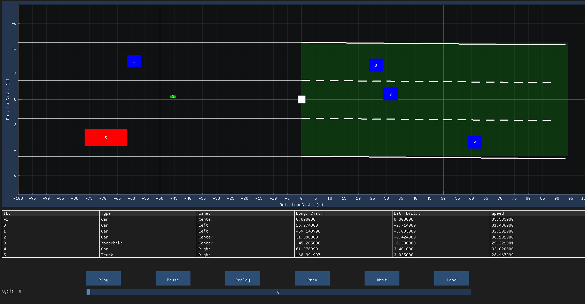

# Exercises

## Example



### Intro

The previously called *speed_mps* is now called *velocity_mps*.  
Velocity is the same but in addition it can be seen as a vector.

The following vehicle properties are added:

- Lateral velocity ($v_{lat} \in \frac{m}{s}$)
- Longitudinal velocity ($v_{long} \in \frac{m}{s}$)
- Heading degree ($deg \in [-180, 180]$)
- Acceleration ($a \in \frac{m}{s^2}$)
- Relative (to the ego vehicle) velocity
- Relative (to the ego vehicle) acceleration

From the data, or so to say from out "radars" and "cameras", we will only recieve the lat. and long velcoity.  
Hence, we have to compute the velocity (non lat. or long.), the heading degree and the acceleration by hand.

## Exercise

### Velocity

To compute the general velocity we can use the lateral and long. velcotiy:  
$v = \sqrt{v_{lat}^2 + v_{long}^2}$

### Heading Degree

To compute the heading degree we can use the following formula:  
$d = \frac{\arctan2(v_{lat}, v_{long})}{\pi} * 180$

Here is a small introduction to the vehicle heading: [link](http://street.umn.edu/VehControl/javahelp/HTML/Definition_of_Vehicle_Heading_and_Steeing_Angle.htm)  
I also created a small python script to compute some heading values on your own.

### Acceleration

To estimate the acceleration we can use the current and previous velocity:  
$v_f$: Current velocity  
$v_i$: Previous velocity  
$t$: Time span between those two velocities (in our case it is 50ms)  
$a = \frac{v_{f} - v_{i}}{t}$

### Relative Velocity/Acceleration

This should be easy, no tips from my side ;)

### Note

Implement these function inside the *src/Perception/Perception.cc* file.  
If possible, use lambda functions and std::algorithms.

```cpp
void compute_velocities(const std::array<float, NUM_ITERATIONS> long_velocities_mps,
                        const std::array<float, NUM_ITERATIONS> lat_velocities_mps,
                        std::array<float, NUM_ITERATIONS> &velocities_mps);

void compute_heading_degrees(const std::array<float, NUM_ITERATIONS> long_velocities_mps,
                             const std::array<float, NUM_ITERATIONS> lat_velocities_mps,
                             std::array<float, NUM_ITERATIONS> &heading_degrees);

void compute_accelerations(const std::array<float, NUM_ITERATIONS> &velocities_mps,
                           std::array<float, NUM_ITERATIONS> &accelerations_mps2);
```
